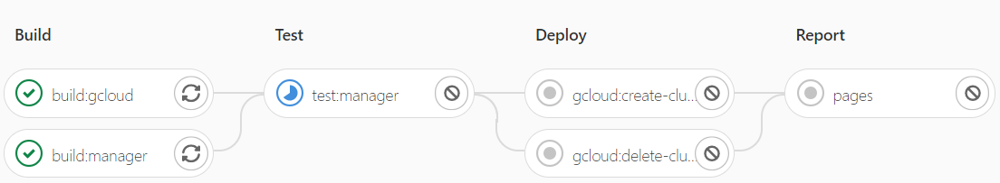
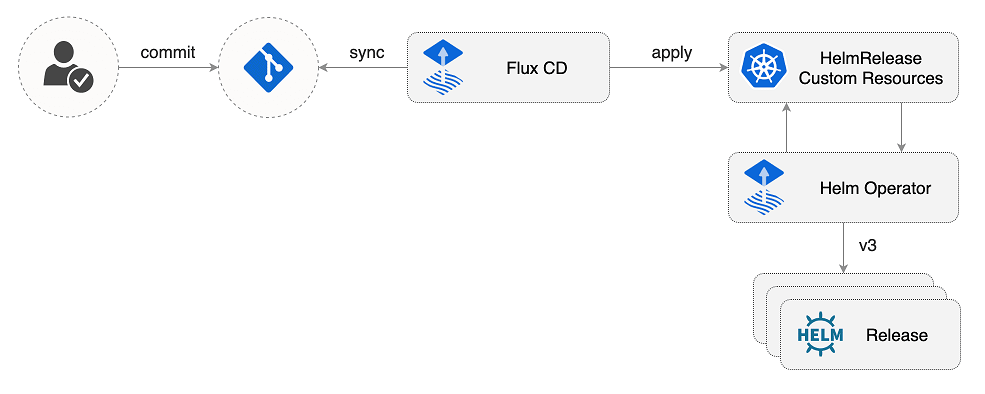

# otus-kuber-2020-04

Project work for the course [Infrastructure Platform based on Kubernetes](https://otus.ru/learning/51674/).

Task: Minimum viable product of the infrastructure platform for the demo application.

| Directory | Description |
| --------- | ----------- |
| doc | Documentation |
| gcloud | Google Cloud SDK + Helmfile image sources |
| gopath/src/ingress-host-manager | Ingress host manager sources |
| helmfile.d | Resources for bootstrapping the infrastructure platform |
| microservices-demo/deploy | Demo application |
| public | Pages content |

## External resources

[GitLab CI/CD project](https://gitlab.com/kshuleshov/otus-kuber-2020-04)

[GitLab Pages with live environment](https://kshuleshov.gitlab.io/otus-kuber-2020-04/)

## Components
### Kubernetes

The project creates managed Kubernetes cluster in the [Google Cloud Platform/Kubernetes Engine](https://console.cloud.google.com/kubernetes).

The Kubernetes version is `1.15.12-gke.2`.
The cluster has the following layout:

| Node pool | Machine type | Size | Targets |
| --------- | ------------ | ---- | ------- |
| `default` | `e2-standard-2` | 1 | User applications |
| `infra-pool` | `e2-standard-2` | 3 | Infrastructure components |

The cluster is [made](./1-create-cluster.sh) with [gcloud](https://cloud.google.com/sdk/install) CLI utility.
 
The [Helmfile](https://github.com/roboll/helmfile) tool [installs](./2-install-infra.sh) all infrastructure components.

The [Ingress Host Manager](./gopath/src/ingress-host-manager) is a small operator,
that composes host names of the ingress resources in the cluster
depending on the IP address, assigned by the Ingress Controller.

### Monitoring

The [Prometheus Operator](https://github.com/prometheus-operator/prometheus-operator)
provides Kubernetes native deployment and management of Prometheus and related monitoring components (Alert Manager, Grafana).

#### Alerts

The [list of alerts](doc/alerts.md).

#### Dashboards

The [list of available dashboards](doc/dashboards.md).

### Centralized logging

The logging in the cluster is implemented with [Elasticsearch](https://www.elastic.co/elasticsearch/),
[Fluent-bit](https://fluentbit.io/) and [Kibana](https://www.elastic.co/kibana).

The [Elasticsearch Exporter](https://github.com/justwatchcom/elasticsearch_exporter)
exports the various metrics about Elasticsearch to Prometheus.

The [index patterns](./helmfile.d/values/files/kibana.import.ndjson)
are created in the Kibana on startup by means of a [extra container](./helmfile.d/values/kibana.values.yaml)
through the [Import object API](https://www.elastic.co/guide/en/kibana/current/saved-objects-api-import.html).

### CI/CD Pipeline

The project uses [pipeline](./.gitlab-ci.yml) in the [auxiliary](https://about.gitlab.com/solutions/github/)
[GitLab Project](https://gitlab.com/kshuleshov/otus-kuber-2020-04/-/pipelines):

| Stage | Job | Manual | Description |
| ----- | --- | ------ | ----------- |
| Build | `build:gcloud` | | Build Docker image with the `gcloud`, `helm` and `helmfile` tools |
| Build | `build:manager` | | Build Docker image with the [Ingress Host Manager](./gopath/src/ingress-host-manager) |
| Test | `test:manager` | | Test the [Ingress Host Manager](./gopath/src/ingress-host-manager) using the [envtest framework](https://book.kubebuilder.io/cronjob-tutorial/writing-tests.html) |
| Deploy | `gcloud:create-cluster` | :heavy_check_mark: | Create/update the GKE cluster and infrastructure components |
| Deploy | `gcloud:delete-cluster` | :heavy_check_mark: | Delete the GKE cluster |
| Report | `pages` | | Publish the [GitLab Page](https://kshuleshov.gitlab.io/otus-kuber-2020-04/) with the cluster endpoints |

The [Flux](https://github.com/fluxcd/flux) combined with the [Helm Operator](https://docs.fluxcd.io/projects/helm-operator/en/latest/) automate the deployment of user applications in a GitOps manner.

### Demo application

The project uses the [Sock Shop by Weaveworks](https://microservices-demo.github.io/) as a demo user application.

Building the Docker images is moved _out of scope_ of the project, the original images are used.

The `microservices-demo/deploy` folder contains
the [customized Helm chart](./microservices-demo/deploy/charts/sock-shop) for the application
and the [corresponding Helm Release](./microservices-demo/deploy/releases/sock-shop.yaml) resource.

To view the application start page open the Sock Shop link on the [GitLab Pages](https://kshuleshov.gitlab.io/otus-kuber-2020-04/)
or go to [GitLab](https://gitlab.com/kshuleshov/otus-kuber-2020-04) »
Operations »
Environments »
gcloud »

If there is no active environment, the cluster is currently stopped.

